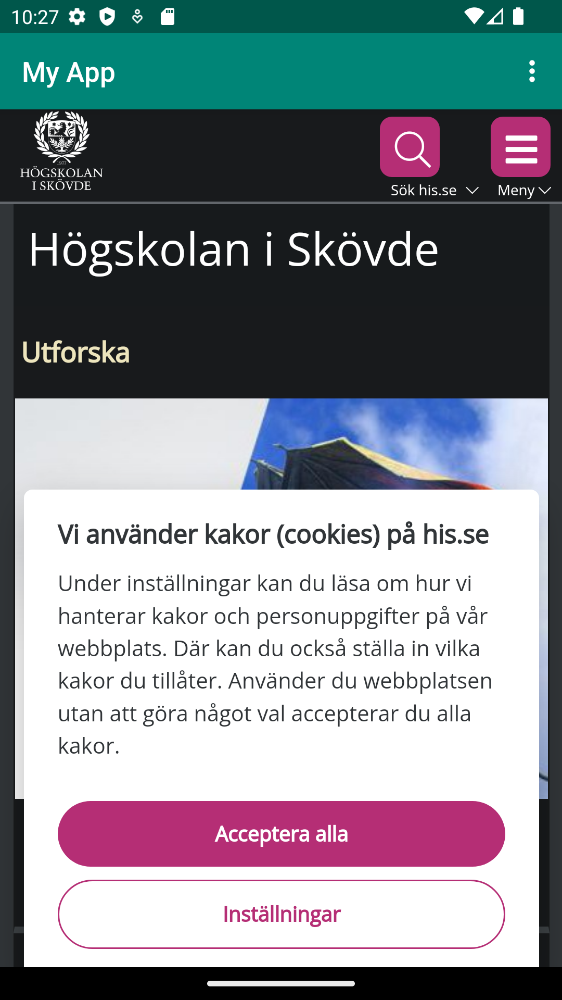
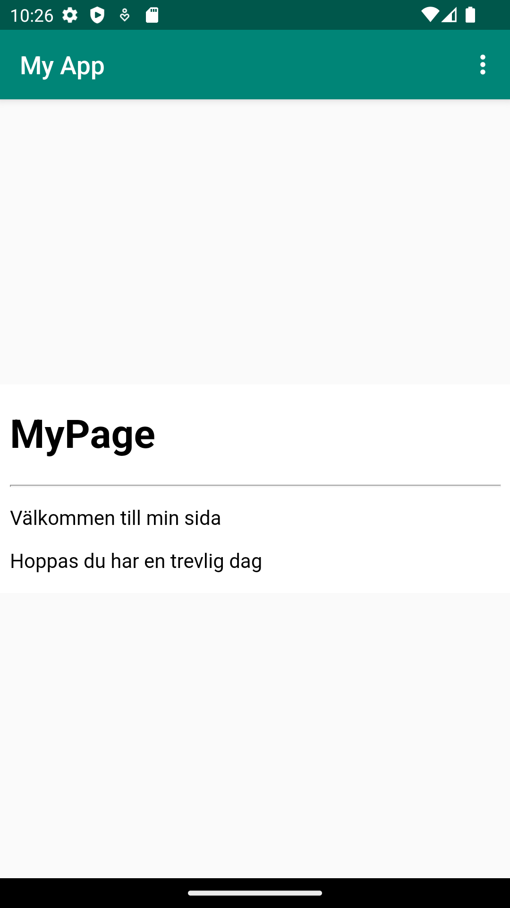

# Assignment 2: WebView

## Rename App
Genom att döpa om text value inom `strings,xml` med `Id ` som motsvarar `app_name`.   
Text value hämtas från `strings.xml` till filen `AndoidManifest.xml` som anropar efter innehållet av `App_name` komponenten.
```java
    android:label="@string/app_name"
// Code from `Androidmanifest.xml`
```

``` java
    <string name="app_name"> My App </string>
    // Code from `string.xml`
```  


## Enable Internet
Genom att lägga till `<uses-permission android:name="android.permission. INTERNET" />` tillåter man att internet används.  
Denna koden används inom `AndroidManifest.xml` för att göra internet tillgängligt inom applikationen.

``` java
    <uses-permission android:name="android.permission.INTERNET" /> 
    // Code from `AndroidManifest.xml`
```

## Create Webview
Create a WebView element in the layout file `content_main.xml` by replacing the existing `TextView`
Give the WebView an ID. Hint: `android:id="@+id/my_webview"`

Genom att ändra från text till webbview input. Istället för en textview komponent visas en webview upp istället. Med hjälp av `android:id="@+id/my_webview` ger man ett specifikt `id` till `Webview`.

``` java
<WebView
        android:id="@+id/my_webview"
        // Code from `MainActivity.java`

```

## Private Member

Lägger till en klass kallad `Webview` med ett attribut som kallas `myWebView`.

``` java
public class MainActivity extends AppCompatActivity {
    private WebView myWebView;
    ...
    // Code from `MainActivity.java`
```


Inom `onCreate()` anger man att `MyWebView` hämtar data från `id` som kallas `my_webview`
``` java
    @Override
    protected void onCreate(Bundle savedInstanceState) {
        super.onCreate(savedInstanceState);
        setContentView(R.layout.activity_main);
        Toolbar toolbar = findViewById(R.id.toolbar);
        setSupportActionBar(toolbar);
        myWebView = findViewById(R.id.my_webview);
        ...
        // Code from `MainActivity.java`
```


## WebviewClient with Enabled Javascript
Create a new WebViewClient to attach to the WebView
Enable Javascript execution in your WebViewClient. Hint: `getSettings()` and `setJavaScriptEnabled()

Genom att skapa en klass kallad WebSettings med webSettings som attribut. motsvarar att hämta settings inom myWebView. Websettings sätts med hjälp av `webSettings.setJavaScriptEnabled(true)`.

``` java
        WebSettings webSettings = myWebView.getSettings();
        webSettings.setJavaScriptEnabled(true);
        // Code from `MainActivity.java`
```


## Html page
Jag skapade en html fil. Jag startade med att skapa en ny `assetfolder` inom mappen som kallas `app`. Jag skapa en ny fil inom mappen `asset` där jag skapa en ny fil som jag kalla `page.html`.
Inom `page.html`filen skapa jag en egen ´Html kod´ till min egna lokala sida.

``` html
<!Doctype html>
<html>
<h1>MyPage</h1>
<hr>
<p>Välkommen till min sida</p>
<p>Hoppas du har en trevlig dag</p>
</html>
<!-- Code from `page.html` -->
```

## Internal Page


``` java
public void showInternalWebPage()
{
    WebView myWebView = (WebView) findViewById(R.id.my_webview);
    myWebView.loadUrl("file:///android_asset/page.html");
}
// Code from `MainActivity.java`
```


``` java
if (id == R.id.action_internal_web) {
    showInternalWebPage();
    Log.d("==>","Will display internal web page");
    return true;
}
// Code from `MainActivity.java` 
```

{width=50 height=100}
_Screenshot of `External Page`_

## External page

``` java
if (id == R.id.action_external_web) {
    showExternalWebPage();
    Log.d("==>","Will display external web page");
    return true;
}
// Code from `MainActivity.java`
```


``` java
if (id == R.id.action_external_web) 
{
    showExternalWebPage();
    Log.d("==>","Will display external web page");
    return true;
}
// Code from `MainActivity.java`
```

{width=50 height=100}
_Screenshot of `Internal Page`_

